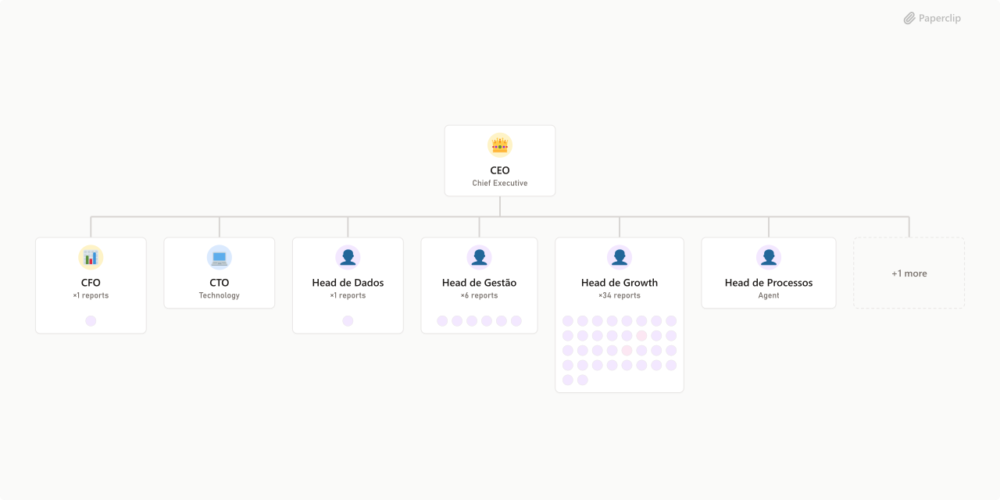

# Neural Trax



## What's Inside

> This is an [Agent Company](https://agentcompanies.io) package from [Paperclip](https://paperclip.ing)

| Content | Count |
|---------|-------|
| Agents | 50 |
| Projects | 1 |
| Skills | 12 |
| Tasks | 2 |

### Agents

| Agent | Role | Reports To |
|-------|------|------------|
| Alfredo Soares | general | head-de-growth |
| Analista de KPIs | general | head-de-dados |
| Analista de NPS | general | customer-experience |
| Analista de Relatórios | general | head-de-tr-fego |
| Analista Web | general | web-designer |
| BDR | general | head-de-convers-o |
| Branding | general | head-de-engajamento |
| CEO | CEO | — |
| CFO | CFO | ceo |
| Churn Recovery | general | head-de-reten-o |
| Cobranca | general | cfo |
| Contratos | general | head-de-convers-o |
| Copywriter | general | head-de-engajamento |
| Criador de Conteúdo | general | diretor-de-arte |
| Criador de Landing Page | general | web-designer |
| CTO | CTO | ceo |
| Customer Experience | general | head-de-reten-o |
| Dale Carnegie | general | head-de-gest-o |
| Diretor de Arte | general | head-de-engajamento |
| Email Marketing | general | head-de-tr-fego |
| Flavio Augusto | general | head-de-gest-o |
| Gerador de Scripts | general | transcri-o-de-chamadas |
| Head de Conversão | general | head-de-growth |
| Head de Dados | general | ceo |
| Head de Engajamento | general | head-de-growth |
| Head de Gestão | general | ceo |
| Head de Growth | CMO | ceo |
| Head de Processos | general | ceo |
| Head de Retenção | general | head-de-growth |
| Head de Tráfego | general | head-de-growth |
| Jordan Peterson | general | head-de-gest-o |
| Mapeador de Objeções | general | transcri-o-de-chamadas |
| Media Buyer | general | head-de-tr-fego |
| Napoleão Hill | general | head-de-gest-o |
| Paulo Cuenca | general | head-de-engajamento |
| Pedro Sobral | general | head-de-tr-fego |
| Product Manager | pm | ceo |
| Reports Generator | general | head-de-tr-fego |
| Rian Dutra | general | web-designer |
| Roger Feder | general | head-de-gest-o |
| SDR | general | head-de-convers-o |
| SEO Agent | general | head-de-tr-fego |
| Social Media | general | head-de-engajamento |
| Suporte | general | customer-experience |
| Tallis Gomes | general | head-de-gest-o |
| Transcrição de Chamadas | general | head-de-convers-o |
| UI Designer | designer | web-designer |
| Upsell Agent | general | head-de-reten-o |
| UX Designer | designer | diretor-de-arte |
| Web Designer | general | head-de-engajamento |

### Projects

- **Onboarding**

### Skills

| Skill | Description | Source |
|-------|-------------|--------|
| telegram-bot-builder | — | catalog |
| slack-bot | > | [github](https://github.com/openclaudia/openclaudia-skills) |
| paperclip-create-agent | > | [github](https://github.com/paperclipai/paperclip/tree/master/skills/paperclip-create-agent) |
| paperclip-create-plugin | > | [github](https://github.com/paperclipai/paperclip/tree/master/skills/paperclip-create-plugin) |
| paperclip | > | [github](https://github.com/paperclipai/paperclip/tree/master/skills/paperclip) |
| para-memory-files | > | [github](https://github.com/paperclipai/paperclip/tree/master/skills/para-memory-files) |
| qwencloud-image-generation | [QwenCloud] Generate and edit images using Wan and Qwen Image models. Supports text-to-image, image editing (style transfer, subject consistency, text rendering), and interleaved text-image output. TRIGGER when: user wants to create illustrations, product images, artistic designs, posters, text-to-image generation, edit/transform existing images, apply style transfer, generate images based on reference photos, interleaved text-image content, mentions Wan/Qwen Image models/AI art creation, or explicitly invokes this skill by name (e.g. use qwencloud-image-generation). DO NOT TRIGGER when: user wants to understand/analyze existing images or OCR (use qwencloud-vision), video generation (use qwencloud-video-generation), text-only tasks. | [github](https://github.com/qwencloud/qwencloud-ai) |
| qwencloud-text | [QwenCloud] Generate text, have conversations, write code, reason, and call functions with Qwen models. TRIGGER when: user asks to chat with Qwen, generate text, write code with Qwen, use Qwen function calling, or explicitly invokes this skill by name (e.g. use qwencloud-text). DO NOT TRIGGER when: general coding questions without Qwen, non-Qwen AI model usage (OpenAI, Gemini, etc.), image/video understanding (use qwencloud-vision), image/video/audio generation. | [github](https://github.com/qwencloud/qwencloud-ai) |
| qwencloud-video-generation | [QwenCloud] Generate videos using Wan models. Supports text-to-video, image-to-video, first+last frame, reference-based role-play, and video editing (VACE). TRIGGER when: user wants to create, generate, or edit video content, mentions video generation/animation/video clips/Wan models, or explicitly invokes this skill by name (e.g. use qwencloud-video-generation). DO NOT TRIGGER when: user wants to generate images (use qwencloud-image-generation), understand/analyze existing videos (use qwencloud-vision), text-only tasks. | [github](https://github.com/qwencloud/qwencloud-ai) |
| seo-geo | SEO & GEO (Generative Engine Optimization) for websites. Analyze keywords, generate schema markup, optimize for AI search engines (ChatGPT, Perplexity, Gemini, Copilot, Claude) and traditional search (Google, Bing). Use when user wants to improve search visibility, search optimization, search ranking, AI visibility, ChatGPT ranking, Google AI Overview, indexing, JSON-LD, meta tags, or keyword research. | [github](https://github.com/resciencelab/opc-skills) |
| telegram-bot-builder | Expert in building Telegram bots that solve real problems - from | [github](https://skills.sh/sickn33/antigravity-awesome-skills/telegram-bot-builder) |
| slack | Interact with Slack workspaces using browser automation. Use when the user needs to check unread channels, navigate Slack, send messages, extract data, find information, search conversations, or automate any Slack task. Triggers include "check my Slack", "what channels have unreads", "send a message to", "search Slack for", "extract from Slack", "find who said", or any task requiring programmatic Slack interaction. | [github](https://github.com/vercel-labs/agent-browser) |

## Getting Started

```bash
pnpm paperclipai company import this-github-url-or-folder
```

See [Paperclip](https://paperclip.ing) for more information.

---
Exported from [Paperclip](https://paperclip.ing) on 2026-04-13
